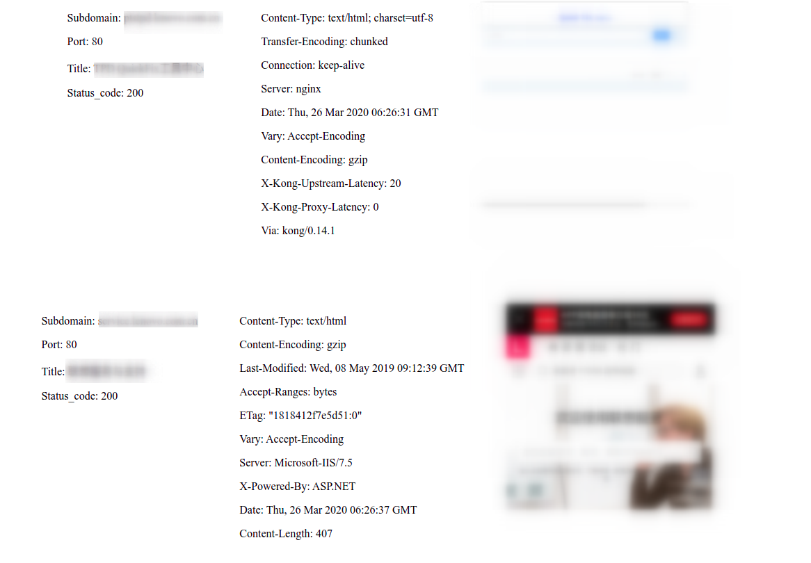

# panSubdomainScanner
子域名收集和整理脚本（python3）

本脚本基于oneforall收集到的子域名的基础上，再次探测和扫描、网页截图，使用html的形式展示

<br>
使用方式：

root权限运行：

```
python3 panSubdomainScanner.py xxx.csv xxx.html &#91;thread number&#93; &#91;port&#93; 
```

其中。xxx.csv为oneforall收集得到的csv

xxx.html为结果输出的html文件

thread number可选，为线程数，默认20

port可选。为要扫描的端口，脚本默认扫描了80和443，如果要新增端口的话就可以写上去（不需要再写80和443），多个端口用英文逗号分开

<br>
本脚本使用了：

nmap作为存活探测以及端口探测

requests验证http和https，以及抓取header

selenium进行网页截图

<br>

需要先安装好Chrome浏览器

需要安装的库：

pip3 install selenium

pip3 install requests

nmap的话我附带上来了，应该不用再装。

那个 chromedriver ，需要给个环境变量才能用。

为了让chrome能够在root模式下运行，需要修改个配置：

```
vim /usr/bin/google-chrome
将 exec -a "$0" "$HERE/chrome" "$@"  改为
exec -a "$0" "$HERE/chrome" "$@" --user-data-dir --no-sandbox
```

<br>

完成之后的HTML界面图：


