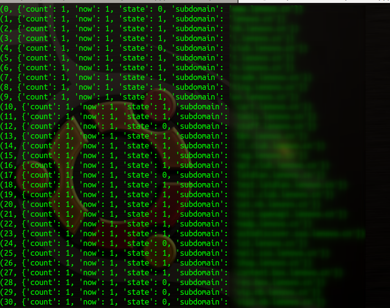
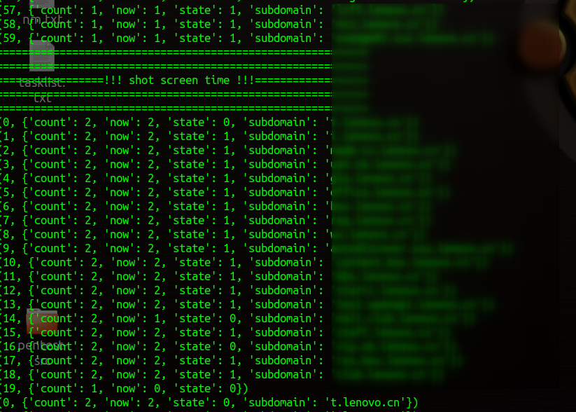
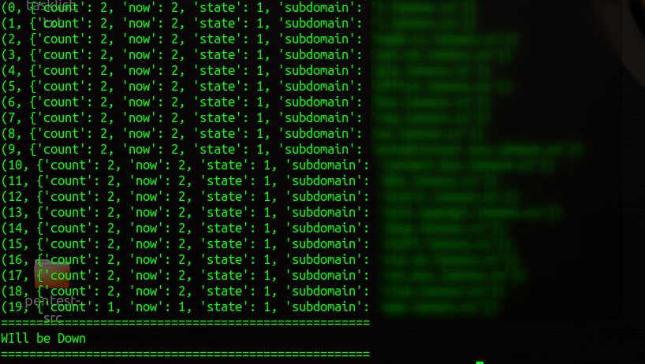

# panSubdomainScanner
子域名收集和整理脚本（python3）

本脚本基于[oneforall](https://github.com/shmilylty/OneForAll)收集到的子域名的基础上，再次探测和扫描、网页截图，使用html的形式展示

<br>
使用方式：

root权限运行：

```
python3 go.py xxx.csv xxx.html [reqThread] [shotThread] [ports]
```

其中。xxx.csv为[oneforall](https://github.com/shmilylty/OneForAll)收集得到的csv

xxx.html为结果输出的html文件

reqThread可选，为进行网页请求的线程数，默认200

shotThread可选，为进行网页截图的线程数，默认30

ports可选。为要扫描的端口，脚本默认扫描了80和443，如果要新增端口的话就可以写上去（不需要再写80和443），多个端口用英文逗号分开

<br>

运行脚本截图：







其中count为每一个线程的总工作量，now为当前探测到第几个子域名，state为完成状态，subdomain为当前探测的子域名。

<br>

**本脚本有三个阶段：**

第一阶段：调用nmap和requests库探测子域存活和信息手机

第二阶段：调用selenium对存活子域和状态码在200-399的子域进行网页截图

第三阶段：将收集得到的信息整理在一个html里


<br>

**运行结束后会在当前目录下生成一些文件：**

img文件夹：存放的是网页截图

xxx.html：信息整理好的html文件，使用浏览器打开

error.log：报错日志，可能里面有些子域用上面的工具探测报错的，但实际我们人工访问可以访问

noWebHost.log：使用nmap扫描时，指定的端口没有开放。这里的子域名可以进行一下全端口扫描

responseDictNone.log：使用requests请求时出错了，可能手动访问可以访问。


<br>
**本脚本使用了：**

nmap作为存活探测以及端口探测

requests验证http和https，以及抓取header

selenium进行网页截图

<br>

**需要先安装好Chrome浏览器**

**需要安装的库：**

pip3 install selenium

pip3 install requests

nmap的话我附带上来了，应该不用再装。

那个 chromedriver ，需要给个环境变量才能用。

为了让chrome能够在root模式下运行，需要修改个配置：

```
vim /usr/bin/google-chrome
将 exec -a "$0" "$HERE/chrome" "$@"  改为
exec -a "$0" "$HERE/chrome" "$@" --user-data-dir --no-sandbox
```

<br>

完成之后的HTML界面图：


